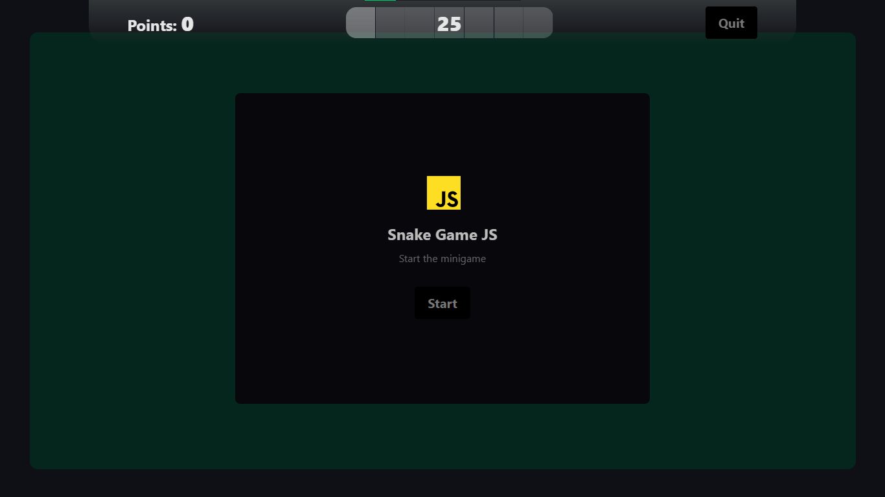
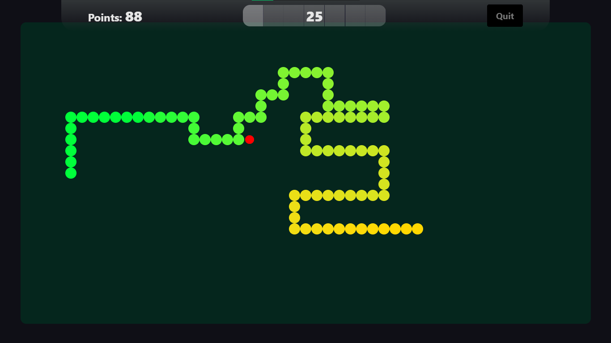
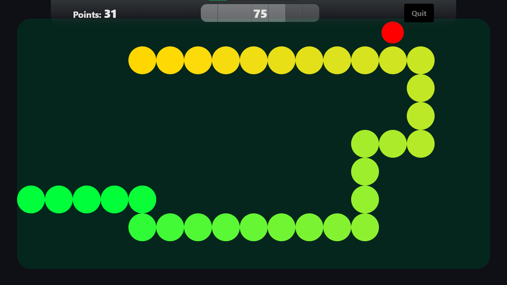
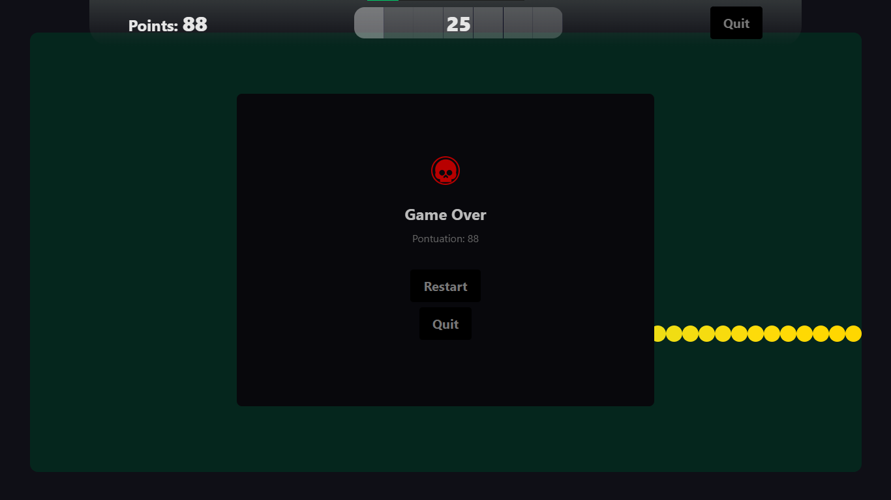

# SnakeGameJs

**Projeto:** SnakeGameJs  
**Autor:** Jhonatan | Nathan  
**GitHub:** [https://github.com/Ntzzn-Dev](https://github.com/Ntzzn-Dev)  
**Data:** 22/09/2025  


 

## Descrição  

Este é o clássico Jogo da Cobra, desenvolvido para ser jogado diretamente no navegador. O objetivo do jogo é controlar a cobra, coletando alimentos e evitando colisões com as paredes ou com o próprio corpo. A cada pedaço de comida consumido, a cobra cresce, tornando o desafio cada vez mais complexo.     

## Demonstração  

### Tela Inicial  
Uma tela simples com a opção de começar o jogo ou trocar o tamanho dos circulos (o padrão é 25).  
<p float="left">

</p>

### Durante o jogo  
O tamanho da área jogável também muda conforme o tamanho dos circulos.    
<p float="left">

</p>

### Tamanho diferente 
Quanto maior o tamanho, menor a área de jogo, tornando mais dificil fazer manobras.    
<p float="left">

</p>

### Game Over
Ao bater em si mesmo ou em uma das bordas, a tela de game over aparece, dando a opção de recomeçar, mudar o tamanho ou sair.    
<p float="left">

</p>

## Editar
Cole no terminal
```
    git clone https://github.com/Ntzzn-Dev/SnakeGameJs.git
    cd SnakeGameJs
    npm install
```

## Jogar  
Apenas entre no link hospedado pelo github:    
[https://ntzzn-dev.github.io/SnakeGameJs/](https://ntzzn-dev.github.io/SnakeGameJs/)  
  
## Baixar  
Clique para baixar o launcher do jogo:  
[Baixar JSnake](https://github.com/Ntzzn-Dev/SnakeGameJs/releases/download/2.2.0/JSnakeGame.Setup.2.2.0.exe)   

Veja o changelog completo em [CHANGELOG.md](CHANGELOG.md)